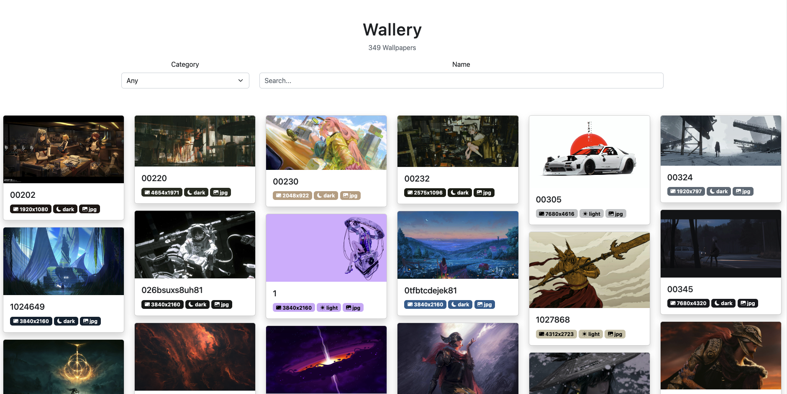

<h1 align="center">Pictura</h1>  
<p align="center">
    
</p>

<h3 align="center">
    Wallpaper Manager 
</h3>

## Table of Contents

- [About](#about)
- [Usage](#usage)
- [Configuration](#configuration)
- [Installation](#installation)

## About

Pictura is a wallpaper manager that automatically
gathers wallpapers metadata, compresses them and generates
a fancy static html page.



## Usage

```bash
mkdir mywalls
cd mywalls

# This will initialize pictura and create `wallpapers` folder
# See `pictura init --help` for more info
pictura init 

# Add some wallpapers
mv oldwalls/* Wallpapers

# Dirs inside `wallpapers` will be treated as categories 
mkdir wallpapers/Nature
mv oldwalls/*forest* wallpapers/Nature

# Generate the page. Now you can visit generated `index.html` 
pictura sync
```

## Configuration

You can edit gallery configuration file at `.pictura/config.toml`

> Pictura is in the early stages of development.
> Configuration file is not yet stable and may change in future.

```toml
# Gallery name
title = "Wallery"

# Enable dark theme support (will be used if system dark theme is enabled)
dark_theme_support = false

# Use animations (affects performance)
animations = false

# If set, will be used instead of local directory
# Useful for hosting on GitHub pages
remote = "https://raw.githubusercontent.com/<USERNAME>/<REPO>/<BRANCH>"
```

You can also use custom html template by creating `index.hbs` at `.pictura` directory.
See [default template](./src/gallery.hbs) for reference.

## Installation

### Using cargo

> Don't have cargo installed? [Download it here](https://doc.rust-lang.org/cargo/getting-started/installation.html)

```bash
cargo install pictura
```
